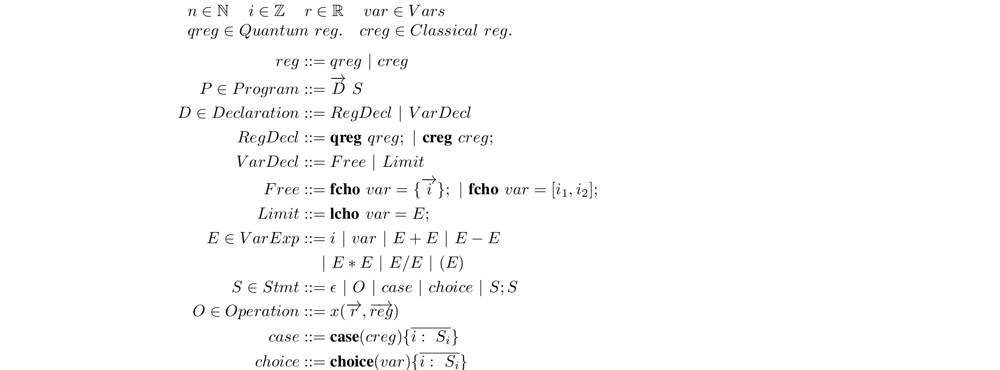

<!-- @import "[TOC]" {cmd="toc" depthFrom=1 depthTo=6 orderedList=false} -->

<!-- code_chunk_output -->

- [1. MQCC Syntax](#1-mqcc-syntax)
  - [1.1. Declarations](#11-declarations)
  - [1.2. Statements](#12-statements)
- [2. MQCC BNF Grammar](#2-mqcc-bnf-grammar)

<!-- /code_chunk_output -->

# 1. MQCC Syntax

The abstract syntax of MQCC


An MQCC program consists of two parts: a sequence of declarations at first and then some statements. Text starts with "\\" is regarded as comments and MQCC compiler will ignore them.

## 1.1. Declarations

There are three kinds of declarations: **ModuleDecl**(Not shown in the abstract syntax), **RegDecl** and **VarDecl**.
**ModuleDecl** refers to the declaration of some subroutines through a keyword *module*. A module in MQCC represents a subroutine and can be instantiated within larger modules or in the main program. For example, a subroutine that swaps two qubits.
```c
module swap(a,b){   \\Swap the state of two registers a,b
    cnot(a,b);
    cnot(b,a);
    cnot(a,b);
}
```
These modules are viewed as macros so are not included in the abstraci syntax.

**RegDecl** refers to declaration for qubit registers and classical registers. It is similar to the syntax in OpenQASM. For example, the declaration for 16 qubits and some classical registers.
```c
qreg q[16];
creg c[16];
```
**VarDecl** refers to the declaration of choice variables that decide how the program behaves. The user-defined objects' cost expressions generated by MQCC are composed of a group of choice variables. 
There are two kinds of choice variables: free one declared with keyword *fcho* and limited one declared with *lcho*. Free choice variables are defined with an integer range. A free choice variable's value can be an integer in the given range, which can be expressed either as an enumeration {a1, a2,..., an} or as an interval [a1, a2] where a1 < a2. For example, two equivalent declarations for a free choice variable *c1* that ranges in {0,1, 2}
```c
fcho c1 = {0, 1, 2};
fcho c1 = [0, 2];
```
Limited choice variables are defined with an expression consist of free choice variables. Value of a limited choice variable depends on the given expression. For example, declaring a limited choice variable *c3* which depends on two free choice variables *c1* and *c2*: 
```c
fcho c1 = {0,1};
fcho c2 = [0,1];
lcho c3 = 1 - c1 * c2;
```
*c3* = 0 when two *fcho* variables *c1* and *c2* is 1, otherwise *c3* = 1.

## 1.2. Statements

The main part of a MQCC program is a **Statement**, which can be empty, an **operation**, a **case** statement, a **choice** statement or a sequence of statements. 

**operation** refers to an operation over a list of registers according to a list of (optional) parameters in the below format
```
opName(params, regs);
```
An operation can be an unitrary gate like
```c
h(q[1]);
cnot(q[1],q[2]);
U(pi/2,q[1]);
```
or the measure operation. For example, measure the qubit q[1] and put into the classical register c[1]
```c
measure(q[1],c[1])
```
MQCC's compilation behavior depends on the object attributes defined by users. So MQCC does not restrict users from using a specific set of operations. Instead, users can define aribitrary operations as long as those operations' behavior are specified in the attribute defined by users. The detail of attribute definition is [here](object_doc.md)

**case** statement is similar to the classical case statement. It chooses a branch based on the value of a classical register. For example
```c
case (c[1]){
    0: h(q[1]);
    default: pass
}
```
**choice** statement choose a candidate branch based on the valuation of a choice variable. For example
```c
fcho c1 = {0, 1};
lcho c2 = 1 - c2;
choice (c1){
    0: h(q[1]);
    default: h(q[2]);
}

choice (c2){
    0: h(q[1]);
    1: h(q[2]);
}
```
The "default" branch is only allowed in the choice statement whose behavior depends on a free choice variable. A choice statement can depend on a choice variable declared explicitly before or on an anonymous free choice variable declared inside the choice statement. The anonymous free choice variables are declared with a given integer range, the same as declaring regular free choice variables. For example, the statement below declares an anonymous free choice variable range in {0, 1}.
```
choice ({0, 1}){
    0: h(q[1]);
    1: h(q[2]);
}
```
When anonymous choice variables are used in the program, MQCC will not generate objects' cost expressions explicitly and only generates the fixed choice MQCC program that satisfies user's goal and constraints.

# 2. MQCC BNF Grammar
```c
Program ::= Declarations Statement

Declarations ::= Declarations Decl | Decl
Decl ::= ModuleDecl | RegDecl ; | VarDecl ;
ModuleDecl ::= "module" ID ( IDList ) { Statement }
RegDecl ::= "qreg" ID [ Int ] | "creg" ID [ Int ]
VarDecl ::= "fcho" IDList = IntRange | "lcho" IDList = VExp
IntRange ::= { IntList } | [ Int , Int ]
IntList ::= IntList , Int | Int
VExp ::= ID | Int | VExp + VExp | VExp - VExp | VExp * VExp | VExp / VExp 
            | VExp % VExp | - VExp | ( VExp )

Statement ::= Operation | Case | Choice | Statement Statement | ε
Operation ::= ID ( ExpList , ArgList ) ; | ID ( ArgList ) ;
Case ::= "case" ( Arg ) { BranchList }
Choice ::= "choice" ( Arg ) { BranchList } | "choice" ( IntRange ) { BranchList }
BranchList ::= BranchList Branch | Branch
Branch ::= Label : Statement | Label : "pass"
Label ::= Int | "default"
ArgList ::= ArgList , Arg | Arg
Arg ::= ID | ID [ Int ]
ExpList ::= ExpList , Exp | Exp
Exp ::= Real | Int | Exp + Exp | Exp - Exp | Exp * Exp | Exp / Exp
             | Exp % Exp | - Exp | ( Exp )
IDList ::= IDList , ID | ID

// Below are regular expressions
ID := [A-Za-z][A-Za-z_0-9]*
Real := ([0-9]+\.[0-9]*|[0-9]*\.[0-9]+)([eE][-+]?[0-9]+)?
Int := [1-9]+[0-9]*|0
```