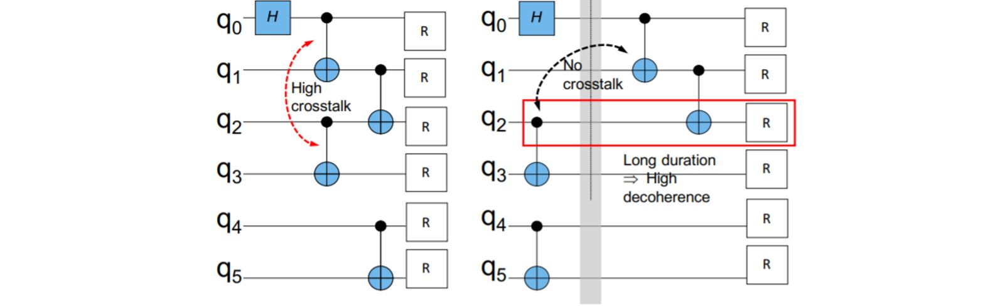

# MQCC Example Applications


<!-- @import "[TOC]" {cmd="toc" depthFrom=1 depthTo=6 orderedList=false} -->

<!-- code_chunk_output -->

- [MQCC Example Applications](#mqcc-example-applications)
  - [Use MQCC to multi-program a quantum computer](#use-mqcc-to-multi-program-a-quantum-computer)
  - [Crosstalk mitigation](#crosstalk-mitigation)
  - [Cost-Effective Circuit Uncomputation](#cost-effective-circuit-uncomputation)

<!-- /code_chunk_output -->

We show some MQCC example applications in this document. These example applications focus on several objects we have already define in src/attrExp.py. You can find the explaination of their definition [here](object_doc.md)

## Use MQCC to multi-program a quantum computer

Multi-programming a quantum computer is to run multiple applications (multi-program) at once on a single quantum computer, rather than run them one at a time (single-program). The problem is that multi-programming a NISQ computer can harm the reliability of individual applications. This is because physical qubits in a NISQ computer exhibit variance in error rates, and single- program compilers tend to allocate qubits with high reliability to applications. Therefore, a multi-program scheme on NISQ computers may allocate weaker qubits to an application and bring degradation in reliability. One solution to this problem is to monitor the reliability at runtime and revert to running applications sequentially if the noise of multi-programming is larger than a predefined threshold.

We demonstrate how to use MQCC to solve this problem. For each quantum application, we write it as a module in the MQCC program. Suppose we have two quantum applications, *Bell1* and *Bell2*
```c
qreg q[10];
creg r[1];

module Bell1(q1,q2){
    h(q1);
    cnot(q1, q2);
}

module Bell2(q1, q2){
    case (r[0]){
            1:  barrier(q1);
                x(q1);
            0:  pass
        }
    h(q1);
    cnot(q1,q2);
}
```
*Bell1* prepares the Bell state $\frac{1}{\sqrt{2}}(|00> + |11>)$. *Bell2* prepares $\frac{1}{\sqrt{2}}(|00> + |11>)$ or $\frac{1}{\sqrt{2}}(|00> - |11>)$ based on the value of a classical register r[0]. Both applications need two qubits. Suppose a NISQ computer provides two areas for the applications, i.e. {q[1], q[2]} area and {q[7], q[8]} area, and {q[1], q[2]} area has a lower error rate than {q[7], q[8]}. The main part of the program is
```c
fcho c1 = {0, 1};
fcho c2 = [0, 1];

choice (c1){
    0:  Bell1(q[1], q[2]);

    1:  Bell1(q[7], q[8]);
}

choice (c2){
    0:  Bell2(q[1], q[2]);

    1:  Bell2(q[7], q[8]);
}
```
Two choice statements decide where to run *Bell1* and *Bell2* based on the value of choice variables c1 and c2 whose range are both {0, 1}. It is easy to see that when c1==c2, *Bell1* and *Bell2* are executed in serial since they are instantiated to the same area. Otherwise they are instantiated on distinct areas and executed in parallel. In the multi-programming problem, we focus on the program's depth and noise. We specify objects **Depth** and **Noise** objects to MQCC(defined [here](object_doc.md)). We specify the *ObjectSet* below for MQCC
```python
ObjectSet = {'Depth': (Depth, 'min'), 'Noise': (Noise, '<0.15', 'add')}
```
It means that we want MQCC to minimize the circuit depth and keep the program's noise less than 0.15. Run MQCC compiler on the program and MQCC will generate the expressions
```python
Depth: [c1,0]*[c2,0]*5 + [c1,1]*[c2,0]*3 + [c1,0]*[c2,1]*3 + [c1,1]*[c2,1]*5

Noise: ([c1,0]*0.027 + [c1,1]*0.043 + [c2,0]*0.027 + [c2,1]*0.045)
```
In the output expression, term [c1, n] means: [c1, n] = 1 if c1 == n else 0. Suppose we set choice variables' values (c1=1, c2=0) which makes *Bell1* and *Bell2* run in parallel on different quantum registers. From the expression you can see that **Depth** is minimized at 3 while **Noise** = 0.106. Setting (c1=0, c2=0) will prompt the two subprograms to run in sequence on the same registers. This results in higher **Depth**(5) but lower **Noise** (0.09). Since the constraint of **Noise** is "<0.15", MQCC will let (c1=1, c2=0) to run two applications in parallel. If user requires a higher fidelity and gives a lower noise threshold 0.10. The *ObjectSet* is
```python
ObjectSet = {'Depth': (Depth, 'min'), 'Noise': (Noise, '<0.10', 'add')}
```
MQCC will choose (c1=0, c2=0) and run them in sequence. 

## Crosstalk mitigation
Crosstalk arises when a certain collection of gates are executed in parallel. It is a major source of noise in NISQ systems, leading to corrupted quantum states and incorrect results. Crosstalk is hardware-specific. For example

The high crosstalk arises if a pair of gates is scheduled simultaneously and can be reduced if scheduled serially instead. But serialization increases circuit depth, which increases the chance of decoherence errors. To solve this problem, we encode possible gate schedules via choice variables in an MQCC program. We make use of the OpenQASM "barrier" operation. For example, consider the following module for each CNOT gate in the program.
```c
module cnotb(q1, q2){
    choice ({0, 1}){
        0:  cnot(q1, q2);
        1:  barrier(q1, q2);
            cnot(q1, q2);
    }
}
```
When the anonymous choice variable is 0, the cnot gate is applied normally (maximum parallel); otherwise, it is executed sequentially only after previous gates on q1,q2 are finished (i.e., barrier(q1,q2) ). In this problem, we specify **crossTalk** (defined [here](object_doc.md)) to the program. The value method of **crossTalk** is 
```python
def value(self):
    ratio = 0
    alpha = 1
    decoherence = math.exp(-alpha * calDepth(self.depthDict))
    crosstalk = calCross(self.gateList)
    return crosstalk + ratio * decoherence
```
It returns the sum of crosstalk and decoherence error with a predefined *ratio*. You can modify the *ratio* and *alpha* to trade off between crosstalk and decoherence error. The *ObjectSet* of this problem is
```python
ObjectSet = {'crosstalk': (crossTalk, 'min')}
```

## Cost-Effective Circuit Uncomputation

When compiling large hierarchy quantum programs into low-level circuits, compilers need to deal with the target machine’s size constraints (limited number of qubits) and time constraints (limited circuit depth). Reusing ancilla qubits (used for temporary storage) requires uncomputing them first, due to quantum mechanics’ no-cloning rule. Eagerly uncomputing ancilla qubits as soon as they are no longer needed can minimize the total number of qubits used in the circuit. However, each uncomputation adds more gates, which increases the circuit’s depth. Uncomputation thus represents a space-time tradeoff: Delay uncomputation to reduce time consumption at the cost of qubit memory consumption, or do the reverse. Two basic strategies have been proposed: “Eager” cleanup and “Lazy” cleanup. The eager strategy performs uncomputation and reclaims ancilla qubits for each function. The lazy strategy reclaims qubits only at the top-level function.

To solve this problem with MQCC, we use choice variables in MQCC to encode the uncomputation strategies. Each function in the MQCC program is written as a module with an input choice variable c ranging in {0, 1}, where reclaimed ancilla qubits are declared by the "release" operation, and hence no longer active.
```c
module foo(c,...){
    ...
    choice (c) {
        0:  pass \\No uncomputation
        1:  uncomputation code; \\Do uncomputation
            release(ancillas);
    }
}
```
For any top-level function calling several sub-routines, its uncomputation can be decided by a limited choice variable which will logically depend on the sub-routines’ choice variables. For example, if all of its sub-routines decide to do uncomputation, there is no need for the top-level function to do uncomputation.
```c
fcho c1,c2 = {0,1};
lcho ct = 1 - c1*c2;

foo1(c1,...);
foo2(c2,...);
choice (ct) {
0: pass \\No uncomputation
1: uncompute code \\Do uncomputation
}
```
This logical dependence can be captured by ct=1-c1\*c2 : when all the sub-routines decide to do uncomputation( c1=c2=1 ), the top-level function won’t do uncomputation as determined by ct=1-c1\*c2=0.

We design attribute **AQV**(Active Quantum Volume) to estimate the corresponding workload for each valuation of choice variables. AQV is defined as the total active time for which each qubit is used in the circuit. A qubit is active if it is not |0>. The attribute definition of **AQV** is [here](object_doc.md). The *ObjectSet* used in this problem is
```python
ObjectSet = {'AQV': (AQV, 'min')}
```