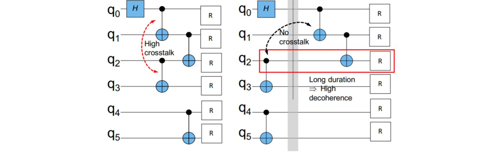

# 1. Define Your Object
You need to know [MQCC syntax](MQCC_syntax.md) before defining your object. To calculate an MQCC program's various objects, MQCC binds some attributes to the MQCC program. Each **Statement** in an MQCC program is associated with a group of attributes. One attribute refers to one kind of object. The attribute semantics of MQCC program is [here](isca21_error_aware.pdf). Each attribute is defined by a tuple *(T, empty, op, case, value)*. 

- *T* is a data type of the states. A state of type *T* consists of information needed in the computation of the object. 
- *empty* is a function deciding the state of an empty MQCC program. It is called to produce the initial state of the program. 
- *op* is a function that transforms the state of a **Statement** to a new state when appending an operation to this **Statement**. 
- *case* is a function deciding the program's state after a case statement given a list of states corresponding to each case branch. 
- *value* computes the target object based on the state.
Users specify the tuple *(T, empty, op, case, value)* by defining a python class. The attribute associated with each **Statement** is an instance of this python class. This python class should inherit from a class *Attr* we have already defined and should contain four methods *empty, op, case, value* in it. The data type *T* is the attribute variables defined in the class. 

We illustrate how to specify the tuple by a python class with some examples. You can find all these example attributes' code in file src/attrExp.py.

<!-- @import "[TOC]" {cmd="toc" depthFrom=1 depthTo=6 orderedList=false} -->

<!-- code_chunk_output -->

- [1. Define Your Object](#1-define-your-object)
  - [1.1. Noise](#11-noise)
  - [1.2. Circuit Depth](#12-circuit-depth)
  - [1.3. Crosstalk](#13-crosstalk)
  - [1.4. Active Quantum Volume(AQV)](#14-active-quantum-volumeaqv)
  - [Debug](#debug)

<!-- /code_chunk_output -->


## 1.1. Noise

We start with attribute **Noise** which refers to the noise error in a program.

```python

class Noise(Attr):

    def empty(self):
        self.error = 0

    def value(self):
        return self.error

    def op(self, opID, regs, args):
        '''
        opID : string
        regs : list of registers
        args : list of real numbers
        '''
        # pseudo = {Pesudo Operation and classical operation}
        if opID not in pseudo:
            self.error += calError(opID, regs)

    def case(self, groups, reg):
        '''
        groups : Each item in groups is a tuple (Int, Noise) or ('default', Noise)
        reg : The register on which the case statement depends
        '''
        self.error = max([p[1].error for p in groups])
```

- *T* and *empty*
The data type needed for an object should be defined in the *empty* method. In Noise example, *empty* defines a *noise* variable refering to the noise of the program to which the attribute bound. For an empty program, its noise should be 0. So the *empty* methods assigns *noise* with 0. 

For other three methods *value*, *op* and *case*, the instance itself refers to the input old state.

- *value*

The value method trivially returns the value of *noise* as the cost of the program.
  
- *op*
  
The *op* method receives three parameters. "opID" is a string refering to the name of the operation; "regs" is a list of registers that used in this operation; "args" is a list of real number refering to the operation's parameter. For each register data type, you can use two methods to get its information.
```python
for reg in regs:
    reg.getName()
    reg.getIndex()
```
"getName" method returns the array name of that register; "getIndex" method returns it index. In this example,
hen appending a new operation to the program, the program's total noise should be increased by that operation's noise. The appending operation's noise is calculated by a function *calNoise* and added to the variable *noise*. The function *calNoise* can be implemented variously based on target machine.

- *case*
- 
The *case* method receives two parameters, "groups" and "reg" . "groups" refers to a list of tuples containing all branches used in the case statement. The tuple's first element is an integer referring to one of the label integers in the case statement of a string "default" referring to the default branch. The second element of the tuple is the corresponding attribute instance of that case branching sub-program. "reg" is the register on which the case statement depends. In the **Noise** example, since we do not know which branch will be chosen in run-time, we conservatively use the maximum noise in all branches as a case statement's noise.

We introduce the concept of additive attribute here. Given a specified attribute, it is an additive attribute if the value of the sequence of aribitrary two statements *A,B* equals to the sum of their repective value.
```
(A B).value() = A.value() + B.value()
```
MQCC compiler can generate lower complexity expressions for additive attributes when the given MQCC program is **choice-in-case-free**. A program is **choice-in-case-free** when there is no *choice* statement nested in any *case* statement in the program. **Noise** is an additive attribute and MQCC can generate better expressions for **Noise** given a **choice-in-case-free** MQCC program. We encourage you to write an **choice-in-case-free** MQCC program as far as possible since this will greatly accelerate MQCC.


## 1.2. Circuit Depth

Circuit depth is an object used in many optimization problem. The python class of circuit depth is
```python
def calDepth(stamp):
    return 0 if len(stamp) == 0 else max(stamp.values())

class Depth(Attr):

    def empty(self):
        self.depthDict = {}

    def op(self, opID, regs, args):
        if opID == 'barrier':
            cur = calDepth(self.depthDict)
            for reg in regs:
                self.depthDict[reg] = cur
        elif opID not in pseudo:
            share = set(self.depthDict.keys()) & set(regs)
            next = calDepth({k: self.depthDict[k] for k in share}) + 1
            for reg in regs:
                self.depthDict[reg] = next

    def value(self):
        return calDepth(self.depthDict)

    def case(self, groups, reg):
        self.depthDict = reduce(lambda a, b: dictMerge(
            a, b, max), [i[1].depthDict for i in groups])
```
We suppose the program is executed in maximum parallel. The data structure *T* used in **Depth** is a map *depthDict* from a register to its depth in the program.
- *empty*
For an empty program, **Depth** starts with an empty map.

- *value*
The depth of a program is the maximum depth of all registers in the program. So the *calDepth* function returns the maximum value of *depthDict*. It returns 0 when meeting an empty map which refers to an empty program.

- *op*
When appending a new operation which is not a "barrier" to the program, the *op* method first calculates the register set that both used the program and the appending operation and assigns it to *share*. The maximum depth of registers in *share* is the layer that all these registers become free. So the appending operation can put on the next layer *next*. Then *op* method updates the depth of registers used by the appending operation with *next*
If the appending operation is a "barrier" operation, we let it have to same effect as in OpenQASM. When meeting a "barrier" operation, *op* updates the depth of registers specified by "barrier" in *depthDict* to the current depth of the program. Thus, future operations applied on these registers will run in layers following the "barrier" statement.

- *case*
For case statement, since we do not know which branch will be chosen in run-time, we just merge the *depthDict* list of all branches. The depth of each register is its maximum depth in all branches.

## 1.3. Crosstalk

Crosstalk arises when a certain collection of gates are executed in parallel. It is a major source of noise in NISQ systems, leading to corrupted quantum states and incorrect results. Crosstalk is hardware-specific.

The python class of crosstalk is
```python
class crossTalk(Attr):
    def empty(self):
        self.depthDict = {}
        self.gateList = [[]]

    def op(self, opID, regs, args):
        if opID == 'barrier':
            cur = calDepth(self.depthDict)
            for reg in regs:
                self.depthDict[reg] = cur
        elif opID not in pseudo:
            share = set(regs) & set(self.depthDict.keys())
            next = calDepth({k: self.depthDict[k] for k in share}) + 1
            for reg in regs:
                self.depthDict[reg] = next
            if next >= len(self.gateList):
                self.gateList.append([])
            self.gateList[next].append((opID, regs))

    def value(self):
        ratio = 0
        alpha = 1
        decoherence = 1 - math.exp(-alpha * calDepth(self.depthDict))
        crosstalk = calCross(self.gateList)
        return crosstalk + ratio * decoherence

    def case(self, groups, reg):
        # The branch with maximum crosstalk
        maxCross = max([i[1] for i in groups], key=lambda x : x.value())
        self.gateList = maxCross.gateList
        self.depthDict = maxCross.depthDict
```
The data structures used by **Crosstalk** are *depthDict* and *gateList*. *depthDict* behaves the same as in the **Depth** attribute. *gateList* is a list of list of operations. Each list in *gateList* refers to one layer and stores all operations executed in this layer. With *gateList*, in *value* method function *calCross* calculates the program's crosstalk according to the hardware information. The final value of **crossTalk** is the sum of crosstalk and decoherence error with a predefined *ratio*. In the *case* method, we choose the branch with the maximum crosstalk as the state after a case statement.

## 1.4. Active Quantum Volume(AQV)

Active Quantum Volume(AQV) is defined as the total active time for which each qubit is used in the circuit. A qubit is active if it is not |0>. The python class of AQV is
```python
def dictMerge(a, b, f):
    return {k: f(a[k], b[k]) if k in a.keys() and k in b.keys() else a.get(k, b.get(k))
            for k in a.keys() | b.keys()}

class AQV(Attr):

    def empty(self):
        self.depthDict = {}
        self.store = 0
        self.startDict = {}

    def op(self, opID, regs, args):

        if opID == 'release':
            for reg in regs:
                if reg in self.depthDict.keys():
                    self.store += self.depthDict.pop(reg) - \
                        self.startDict.pop(reg)
        elif opID == 'barrier':
            cur = calDepth(self.depthDict)
            for reg in regs:
                self.depthDict[reg] = cur
        else:
            share = set(regs) & set(self.depthDict.keys())
            startTime = calDepth({k: self.depthDict[k] for k in share})
            for reg in regs:
                self.depthDict[reg] = startTime + 1
                self.startDict[reg] = self.startDict.get(reg, startTime)

    def value(self):
        depth = calDepth(self.depthDict)
        stillActiveAQV = sum([depth - value for value in self.startDict.values()])
        aqv = self.store + stillActiveAQV
        return aqv

    def case(self, group, reg):
        self.store = max([i[1].store for i in group])

        self.depthDict = reduce(lambda a, b: dictMerge(
            a, b, max), [i[1].depthDict for i in group])
        self.startDict = reduce(lambda a, b: dictMerge(
            a, b, min), [i[1].startDict for i in group])
```
There are three data structures used in **AQV** class: *DepthDict* is a map from an active register to its depth in the program; *StartDict* is a map from an active register to the depth where it becomes active; *store* saves active quantum volume of those released registers. In the presence of the "release" operation, *op* methos will remove those released registers from the active set, calculate their active time and save it in variable *store*. Otherwise, *op* updates *DepthDict* the same as in **Depth**. When meeting a register not in *StartDict*, *op* also inserts its depth into *StartDict*. The total AQV of the program is the accumulation of active registers’ active time and released registers’ active time saved in *store*

## Debug
Sometimes you want to run some small MQCC programs to test whether you define your object correctly. In this case, you may want to know the object's final state instead of only its value. To do this, you can let the *value* method returns a string representing the object's state and run MQCC with parameter "-d" which lets MQCC only generate expressions for objects and not call z3 solver. For example, suppose you want to check the final state of **Depth** object, you can define the *value* method as
```python
    def value(self):
        return str(self.depthDict)
```
Then run MQCC with parameter "-d" on some test programs, the state will be written into the file "Expressions".